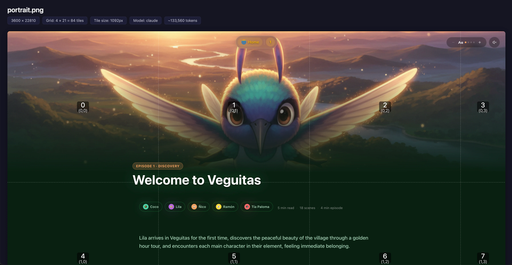

# image-tiler-mcp-server

Split large images into optimally-sized tiles so LLM vision models see every detail — no downscaling, no lost text.

<p align="center">
  
</p>

## Why tiling matters

LLM vision systems have a **maximum input resolution**. When you send an image larger than that limit, the model silently downscales it before processing. A 3600×22810 full-page screenshot gets shrunk to ~247×1568 by Claude — text becomes unreadable, UI details disappear, and the model can't analyze what it can't see.

**Tiling solves this.** This MCP server:

1. Reads the image dimensions and the target model's vision config
2. Calculates an optimal grid that keeps every tile within the model's sweet spot
3. Extracts tiles as individual PNGs and saves them to disk
4. Returns metadata (grid layout, file paths, estimated token cost)
5. Serves tiles back as base64 in paginated batches for the LLM to analyze

Each tile is processed at **full resolution** — no downscaling — preserving text, UI elements, and fine detail across the entire image.

See [sample of generated tiles here.](https://github.com/keiver/image-tiler-mcp-server/tree/main/assets/tiles/)

### Supported Models

| Model | Default tile | Tokens/tile | Max tile | ID |
|-------|-------------|-------------|----------|-----|
| Claude (default) | 1092px | 1590 | 1568px | `claude` |
| OpenAI (GPT-4o/o-series) | 768px | 765 | 2048px | `openai` |
| Gemini | 768px | 258 | 768px | `gemini` |
| Gemini 3 | 1536px | 1120 | 3072px | `gemini3` |

> **OpenAI note:** The `openai` config targets the GPT-4o / o-series vision pipeline (512px tile patches). GPT-4.1 uses a fundamentally different pipeline (32x32 pixel patches) and is not currently supported — it would require a separate model config with a different calculation approach.

> **Gemini 3 note:** Gemini 3 uses a fixed token budget per image (1120 tokens regardless of dimensions). Tiling increases total token cost but preserves fine detail. For cases where detail isn't critical, consider sending a single image instead.

## Tools

### `tiler_tile_image`

Splits a large image into tiles and saves them to disk.

| Parameter | Type | Required | Default | Description |
|---|---|---|---|---|
| `filePath` | string | yes | — | Absolute or relative path to the image file |
| `model` | string | no | `"claude"` | Target vision model: `"claude"`, `"openai"`, `"gemini"`, `"gemini3"` |
| `tileSize` | number | no | Model default | Tile size in pixels. Clamped to model min/max with a warning if out of bounds. |
| `outputDir` | string | no | `tiles/{name}` subfolder next to source | Directory to save tiles |

Returns JSON metadata with grid dimensions, tile count, model used, estimated token cost, and per-tile file paths.

### `tiler_get_tiles`

Returns tile images as base64 in batches of 5 for the LLM to see directly.

| Parameter | Type | Required | Default | Description |
|---|---|---|---|---|
| `tilesDir` | string | yes | — | Path to tiles directory (from `tiler_tile_image`) |
| `start` | number | no | 0 | Start tile index (0-based, inclusive) |
| `end` | number | no | start + 4 | End tile index (0-based, inclusive) |

Returns text labels + image content blocks. Includes pagination hint for the next batch.

## Installation

### Claude Code

```bash
claude mcp add image-tiler -- npx -y image-tiler-mcp-server
```

> `image-tiler` is a local alias — you can name it anything you like. `image-tiler-mcp-server` is the npm package that gets downloaded and run.

See [Claude Code MCP docs](https://docs.anthropic.com/en/docs/claude-code/mcp) for more info.

### Claude Desktop

Add to your Claude Desktop config file:

- **macOS:** `~/Library/Application Support/Claude/claude_desktop_config.json`
- **Windows:** `%APPDATA%\Claude\claude_desktop_config.json`
- **Linux:** `~/.config/Claude/claude_desktop_config.json`

```json
{
  "mcpServers": {
    "image-tiler": {
      "command": "npx",
      "args": ["-y", "image-tiler-mcp-server"]
    }
  }
}
```

Restart Claude Desktop after editing.

### VS Code (Cline / Continue)

Add to your VS Code MCP settings:

```json
{
  "image-tiler": {
    "command": "npx",
    "args": ["-y", "image-tiler-mcp-server"]
  }
}
```

### Cursor

Add to `~/.cursor/mcp.json`:

```json
{
  "mcpServers": {
    "image-tiler": {
      "command": "npx",
      "args": ["-y", "image-tiler-mcp-server"]
    }
  }
}
```

### Global Install (faster startup)

```bash
npm install -g image-tiler-mcp-server
```

Then use the simpler config in any client:

```json
{
  "command": "image-tiler-mcp-server"
}
```

### From Source

```bash
git clone https://github.com/keiver/image-tiler-mcp-server.git
cd image-tiler-mcp-server
npm install
npm run build
```

Then point your MCP config to the built file:

```json
{
  "command": "node",
  "args": ["/absolute/path/to/image-tiler-mcp-server/dist/index.js"]
}
```

## Usage

### In Claude Code

```
> Tile the screenshot at ./screenshots/full-page.png and analyze the layout

Claude will:
1. Call tiler_tile_image(filePath="./screenshots/full-page.png")
2. See: "Tiled 3600x22810 image → 4x21 grid = 84 tiles"
3. Call tiler_get_tiles(tilesDir="./screenshots/tiles/full-page", start=0, end=4)
4. Analyze tiles 0-4, then continue with start=5...
```

### With Other Models

```
> Tile this image for GPT-4o analysis

Claude will:
1. Call tiler_tile_image(filePath="./image.png", model="openai")
2. Tiles sized at 768px for OpenAI's vision pipeline
```

### Typical Workflow

1. Capture full-page screenshot with your browser extension
2. Ask Claude: _"Tile `/path/to/screencapture-localhost-3000.png` and review all sections"_
3. Claude pages through tiles automatically, analyzing each batch

## Tile Output Structure

Example: `assets/landscape.png` (7680x4032) tiled with the default Claude config (1092px tiles) produces an 8x4 grid of 32 tiles (~50,880 tokens).

**Grid layout** — tiles are numbered `tile_ROW_COL.png`, extracted left-to-right, top-to-bottom:

```
 7680px
┌──────────┬──────────┬──────────┬──────────┬──────────┬──────────┬──────────┬────────┐
│ 000_000  │ 000_001  │ 000_002  │ 000_003  │ 000_004  │ 000_005  │ 000_006  │ 000_007│
│ 1092x1092│ 1092x1092│ 1092x1092│ 1092x1092│ 1092x1092│ 1092x1092│ 1092x1092│ 36x1092│ 4032px
├──────────┼──────────┼──────────┼──────────┼──────────┼──────────┼──────────┼────────┤
│ 001_000  │ 001_001  │ 001_002  │ 001_003  │ 001_004  │ 001_005  │ 001_006  │ 001_007│
│ 1092x1092│ 1092x1092│ 1092x1092│ 1092x1092│ 1092x1092│ 1092x1092│ 1092x1092│ 36x1092│
├──────────┼──────────┼──────────┼──────────┼──────────┼──────────┼──────────┼────────┤
│ 002_000  │ 002_001  │ 002_002  │ 002_003  │ 002_004  │ 002_005  │ 002_006  │ 002_007│
│ 1092x1092│ 1092x1092│ 1092x1092│ 1092x1092│ 1092x1092│ 1092x1092│ 1092x1092│ 36x1092│
├──────────┼──────────┼──────────┼──────────┼──────────┼──────────┼──────────┼────────┤
│ 003_000  │ 003_001  │ 003_002  │ 003_003  │ 003_004  │ 003_005  │ 003_006  │ 003_007│
│ 1092x756 │ 1092x756 │ 1092x756 │ 1092x756 │ 1092x756 │ 1092x756 │ 1092x756 │ 36x756 │
└──────────┴──────────┴──────────┴──────────┴──────────┴──────────┴──────────┴────────┘
```

Edge tiles are smaller: the rightmost column is 36px wide (7680 - 7×1092 = 36), and the bottom row is 756px tall (4032 - 3×1092 = 756).

**Output directory:**

```
assets/tiles/landscape/
├── tile_000_000.png    # Row 0, Col 0 — 1092x1092
├── tile_000_001.png    # Row 0, Col 1 — 1092x1092
├── tile_000_002.png    # ...
├── ...
├── tile_000_007.png    # Row 0, Col 7 — 36x1092 (right edge)
├── tile_001_000.png    # Row 1, Col 0
├── ...
├── tile_003_006.png    # Row 3, Col 6 — 1092x756 (bottom edge)
└── tile_003_007.png    # Row 3, Col 7 — 36x756 (corner)
```

**JSON metadata** returned by `tiler_tile_image`:

```json
{
  "model": "claude",
  "sourceImage": {
    "width": 7680,
    "height": 4032,
    "format": "png",
    "fileSize": 12345678,
    "channels": 4
  },
  "grid": {
    "cols": 8,
    "rows": 4,
    "totalTiles": 32,
    "tileSize": 1092,
    "estimatedTokens": 50880
  },
  "outputDir": "/path/to/assets/tiles/landscape",
  "tiles": [
    { "index": 0, "row": 0, "col": 0, "position": "0,0", "dimensions": "1092×1092", "filePath": "/path/to/assets/tiles/landscape/tile_000_000.png" },
    { "index": 1, "row": 0, "col": 1, "position": "1092,0", "dimensions": "1092×1092", "filePath": "/path/to/assets/tiles/landscape/tile_000_001.png" },
    "... 30 more tiles"
  ],
  "previewPath": "/path/to/assets/tiles/landscape/preview.html"
}
```

### Portrait example

`assets/portrait.png` (3600x22810) tiled with Claude defaults produces a 4x21 grid of 84 tiles (~133,560 tokens).

**Grid layout:**

```
 3600px
┌──────────┬──────────┬──────────┬─────────┐
│ 000_000  │ 000_001  │ 000_002  │ 000_003 │
│ 1092x1092│ 1092x1092│ 1092x1092│ 324x1092│
├──────────┼──────────┼──────────┼─────────┤
│ 001_000  │ 001_001  │ 001_002  │ 001_003 │
│ 1092x1092│ 1092x1092│ 1092x1092│ 324x1092│ 22810px
├──────────┼──────────┼──────────┼─────────┤
│   ...    │   ...    │   ...    │   ...   │ (21 rows)
├──────────┼──────────┼──────────┼─────────┤
│ 020_000  │ 020_001  │ 020_002  │ 020_003 │
│ 1092x970 │ 1092x970 │ 1092x970 │ 324x970 │
└──────────┴──────────┴──────────┴─────────┘
```

Edge tiles: rightmost column is 324px wide (3600 - 3×1092 = 324), bottom row is 970px tall (22810 - 20×1092 = 970).

## Token Cost Reference

Costs vary by model. Formula: `tokens = totalTiles x tokensPerTile`

### Claude (1092px tiles, 1590 tokens/tile)

| Image Dimensions | Tiles | Estimated Tokens |
|---|---|---|
| 1440x3000 | 6 | ~9,540 |
| 3600x5000 | 20 | ~31,800 |
| 3600x22810 | 84 | ~133,560 |

### OpenAI — GPT-4o/o-series (768px tiles, 765 tokens/tile)

| Image Dimensions | Tiles | Estimated Tokens |
|---|---|---|
| 1440x3000 | 8 | ~6,120 |
| 3600x5000 | 35 | ~26,775 |
| 3600x22810 | 150 | ~114,750 |

### Gemini (768px tiles, 258 tokens/tile)

| Image Dimensions | Tiles | Estimated Tokens |
|---|---|---|
| 1440x3000 | 8 | ~2,064 |
| 3600x5000 | 35 | ~9,030 |
| 3600x22810 | 150 | ~38,700 |

### Gemini 3 (1536px tiles, 1120 tokens/tile)

| Image Dimensions | Tiles | Estimated Tokens |
|---|---|---|
| 1440x3000 | 2 | ~2,240 |
| 3600x5000 | 12 | ~13,440 |
| 3600x22810 | 45 | ~50,400 |

> **Note:** Gemini 3 uses a fixed 1120 tokens per image regardless of dimensions. More tiles = more total tokens but better detail preservation.

## Supported Formats

PNG, JPEG, WebP, TIFF, GIF

## Technical Details

- **Image processing:** Sharp (libvips) — demand-driven pipeline, streams tiles without full decompression
- **Memory usage:** ~350-400MB peak for 30MB+ PNGs
- **Transport:** stdio (local, single-session)
- **Tile naming:** `tile_ROW_COL.png` (zero-padded, e.g., `tile_000_003.png`)
- **Grid order:** Left-to-right, top-to-bottom
- **Batch limit:** 5 tiles per `tiler_get_tiles` call to stay within MCP response limits

## Troubleshooting

**"Command not found"** — Make sure Node.js 18+ is installed: `node --version`

**"File not found"** — Use absolute paths. Relative paths resolve from the MCP server's working directory.

**"MCP tools not available"** — Restart your MCP client after config changes. In Claude Code, run `/mcp` to check server status.

## Security

This is a **local MCP server** that runs on your machine via stdio. It operates with the same filesystem permissions as the MCP client process that spawns it. File paths provided to the tools are resolved and accessed directly — there is no sandboxing or path restriction beyond your OS-level permissions.

This is by design: MCP tools run in the user's security context, same as any CLI tool. No network access, no remote connections, no data sent externally.

## Requirements

- Node.js 18+
- Compatible MCP client (Claude Code, Claude Desktop, Cursor, VS Code with MCP extension)

## License

MIT

## Links

- [GitHub Repository](https://github.com/keiver/image-tiler-mcp-server)
- [NPM Package](https://www.npmjs.com/package/image-tiler-mcp-server)
- [Report Issues](https://github.com/keiver/image-tiler-mcp-server/issues)
