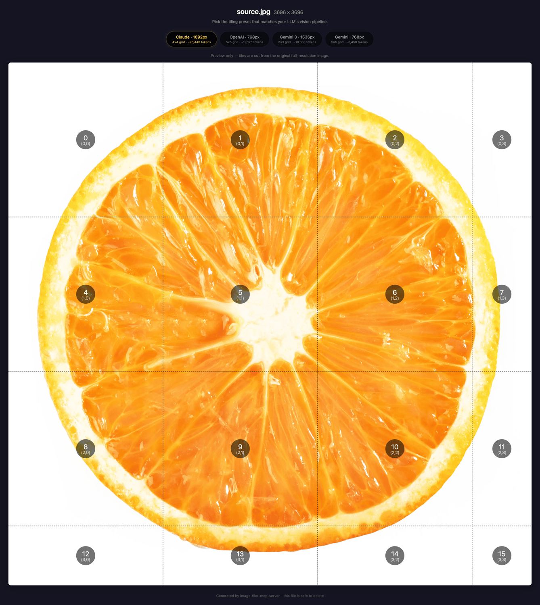

# image-tiler-mcp-server

Split large images into optimally-sized tiles so LLM vision models see every detail - no downscaling, no lost text.

<p align="center">
  
</p>

## Installation

### Claude Code

```bash
claude mcp add image-tiler -- npx -y image-tiler-mcp-server
```

> `image-tiler` is a local alias - you can name it anything you like. `image-tiler-mcp-server` is the npm package that gets downloaded and run.

See [Claude Code MCP docs](https://docs.anthropic.com/en/docs/claude-code/mcp) for more info.

### Codex CLI

```bash
codex mcp add image-tiler -- npx -y image-tiler-mcp-server
```

Or add to `~/.codex/config.toml`:

```toml
[mcp_servers.image-tiler]
command = "npx"
args = ["-y", "image-tiler-mcp-server"]
```

### VS Code (Cline / Continue)

Add to your VS Code MCP settings:

```json
{
  "image-tiler": {
    "command": "npx",
    "args": ["-y", "image-tiler-mcp-server"]
  }
}
```

### Cursor

Add to `~/.cursor/mcp.json`:

```json
{
  "mcpServers": {
    "image-tiler": {
      "command": "npx",
      "args": ["-y", "image-tiler-mcp-server"]
    }
  }
}
```

### Claude Desktop

Add to your Claude Desktop config file:

- **macOS:** `~/Library/Application Support/Claude/claude_desktop_config.json`
- **Windows:** `%APPDATA%\Claude\claude_desktop_config.json`
- **Linux:** `~/.config/Claude/claude_desktop_config.json`

```json
{
  "mcpServers": {
    "image-tiler": {
      "command": "npx",
      "args": ["-y", "image-tiler-mcp-server"]
    }
  }
}
```

Restart Claude Desktop after editing.

### Global Install (faster startup)

```bash
npm install -g image-tiler-mcp-server
```

Then use the simpler config in any client:

```json
{
  "command": "image-tiler-mcp-server"
}
```

### From Source

```bash
git clone https://github.com/keiver/image-tiler-mcp-server.git
cd image-tiler-mcp-server
npm install
npm run build
```

Then point your MCP config to the built file:

```json
{
  "command": "node",
  "args": ["/absolute/path/to/image-tiler-mcp-server/dist/index.js"]
}
```

## Tiling for LLM Vision

LLM vision systems have a **maximum input resolution**. When you send an image larger than that limit, the model silently downscales it before processing. A 3600×22810 full-page screenshot gets shrunk to ~247×1568 by Claude - text becomes unreadable, UI details disappear, and the model can't analyze what it can't see.

**Tiling solves this.** This MCP server:

1. Reads the image dimensions and the target model's vision config
2. Calculates an optimal grid that keeps every tile within the model's sweet spot
3. Extracts tiles as individual PNGs and saves them to disk
4. Returns metadata (grid layout, file paths, estimated token cost)
5. Serves tiles back as base64 in paginated batches for the LLM to analyze

Each tile is processed at **full resolution** - no downscaling - preserving text, UI elements, and fine detail across the entire image.

**Auto-downscaling:** Images over 10,000px on their longest side are automatically downscaled before tiling (configurable via `maxDimension`). This prevents extreme tile counts on very long screenshots - e.g., a 3600×22810 page drops from 84 tiles / ~134K tokens to 20 tiles / ~32K tokens with no visible quality loss. Set `maxDimension=0` to disable.

### Supported Models

| Model | Default tile | Tokens/tile | Max tile | ID |
|-------|-------------|-------------|----------|-----|
| Claude (default) | 1092px | 1590 | 1568px | `claude` |
| OpenAI (GPT-4o/o-series) | 768px | 765 | 2048px | `openai` |
| Gemini | 768px | 258 | 768px | `gemini` |
| Gemini 3 | 1536px | 1120 | 3072px | `gemini3` |

> **OpenAI note:** The `openai` config targets the GPT-4o / o-series vision pipeline (512px tile patches). GPT-4.1 uses a fundamentally different pipeline (32x32 pixel patches) and is not currently supported - it would require a separate model config with a different calculation approach.

> **Gemini 3 note:** Gemini 3 uses a fixed token budget per image (1120 tokens regardless of dimensions). Tiling increases total token cost but preserves fine detail. For cases where detail isn't critical, consider sending a single image instead.

## Tools

### `tiler_tile_image`

Splits a large image into tiles and saves them to disk.

| Parameter | Type | Required | Default | Description |
|---|---|---|---|---|
| `filePath` | string | no* | - | Absolute or relative path to the image file |
| `sourceUrl` | string | no* | - | HTTPS URL to download the image from (max 50MB, 30s timeout) |
| `dataUrl` | string | no* | - | Data URL with base64-encoded image |
| `imageBase64` | string | no* | - | Raw base64-encoded image data |
| `model` | string | no | `"claude"` | Target vision model: `"claude"`, `"openai"`, `"gemini"`, `"gemini3"` |
| `tileSize` | number | no | Model default | Tile size in pixels. Clamped to model min/max with a warning if out of bounds. |
| `maxDimension` | number | no | `10000` | Max dimension in px (0-65536). Pre-downscales the image so its longest side fits within this value before tiling. Defaults to 10000px. Set to 0 to disable auto-downscaling. No-op if already within bounds. |
| `outputDir` | string | no | `tiles/{name}` subfolder next to source | Directory to save tiles |

*At least one image source (`filePath`, `sourceUrl`, `dataUrl`, or `imageBase64`) is required.

Returns JSON metadata with grid dimensions, tile count, model used, estimated token cost, and per-tile file paths.

### `tiler_get_tiles`

Returns tile images as base64 in batches of 5 for the LLM to see directly.

| Parameter | Type | Required | Default | Description |
|---|---|---|---|---|
| `tilesDir` | string | yes | - | Path to tiles directory (from `tiler_tile_image`) |
| `start` | number | no | 0 | Start tile index (0-based, inclusive) |
| `end` | number | no | start + 4 | End tile index (0-based, inclusive) |

Returns text labels + image content blocks. Includes pagination hint for the next batch.

### `tiler_recommend_settings`

Dry-run estimator: reads image dimensions and returns cost estimates **without tiling**.

| Parameter | Type | Required | Default | Description |
|---|---|---|---|---|
| `filePath` | string | no* | - | Path to image file |
| `sourceUrl` | string | no* | - | HTTPS URL to download from |
| `dataUrl` | string | no* | - | Data URL with base64 image |
| `imageBase64` | string | no* | - | Raw base64 image data |
| `model` | string | no | `"claude"` | Target vision model |
| `tileSize` | number | no | Model default | Override tile size (skips heuristics) |
| `maxDimension` | number | no | - | Override max dimension (skips heuristics) |
| `intent` | string | no | - | `"text_heavy"`, `"ui_screenshot"`, `"diagram"`, `"photo"`, `"general"` |
| `budget` | string | no | - | `"low"`, `"default"`, `"max_detail"` |

*At least one image source required.

Returns JSON with recommended settings, rationale, image info, grid estimate, and a comparison across all 4 models.

### `tiler_prepare_image`

One-shot convenience tool: tiles an image AND returns the first batch of tiles in a single call.

| Parameter | Type | Required | Default | Description |
|---|---|---|---|---|
| `filePath` | string | no* | - | Path to image file |
| `sourceUrl` | string | no* | - | HTTPS URL to download from |
| `dataUrl` | string | no* | - | Data URL with base64 image |
| `imageBase64` | string | no* | - | Raw base64 image data |
| `model` | string | no | `"claude"` | Target vision model |
| `tileSize` | number | no | Model default | Override tile size |
| `maxDimension` | number | no | `10000` | Max dimension for auto-downscaling |
| `outputDir` | string | no | `tiles/{name}` subfolder | Directory to save tiles |
| `page` | number | no | `0` | Tile page (0 = tiles 0-4, 1 = tiles 5-9, etc.) |

*At least one image source required.

Returns tiling metadata + up to 5 tile images inline. Saves a round-trip compared to calling `tiler_tile_image` then `tiler_get_tiles` separately.

## Usage

### Quick Start

```
> Tile the screenshot at ./screenshots/full-page.png and analyze the layout

Your MCP client will:
1. Call tiler_recommend_settings(filePath="./screenshots/full-page.png") to preview token costs
2. Call tiler_prepare_image(filePath="./screenshots/full-page.png") to tile and get the first batch
3. Call tiler_get_tiles(tilesDir="...", start=5, end=9) for subsequent batches
```

### With Other Models

```
> Tile this image for GPT-4o analysis

Your MCP client will:
1. Call tiler_tile_image(filePath="./image.png", model="openai")
2. Tiles sized at 768px for OpenAI's vision pipeline
```

### Auto-Downscaling

Images over 10,000px are automatically downscaled before tiling. You can customize the limit:

```
> Tile this 7680x4032 screenshot but downscale to 2048px first to save tokens

Your MCP client will:
1. Call tiler_tile_image(filePath="./image.png", maxDimension=2048)
2. Image is downscaled to 2048x1076 before tiling
3. Fewer tiles = lower token cost (e.g., 4 tiles instead of 32)
```

To disable auto-downscaling entirely:

```
> Tile this image at full resolution, no downscaling

Your MCP client will:
1. Call tiler_tile_image(filePath="./image.png", maxDimension=0)
2. Image is tiled at its original dimensions
```

### Estimating Costs

Use `tiler_recommend_settings` to preview token costs before tiling:

```
> How many tokens would it cost to tile this 3600x22810 screenshot?

Your MCP client will:
1. Call tiler_recommend_settings(filePath="./screenshot.png")
2. See cost estimates for all 4 models
3. Make an informed decision before committing to tiling
```

With intent and budget hints:

```
> Estimate costs for this long document screenshot, keeping tokens low

Your MCP client will:
1. Call tiler_recommend_settings(filePath="./doc.png", intent="text_heavy", budget="low")
2. Get optimized maxDimension recommendation for text-heavy content
```

### Using URLs / Base64

All image-accepting tools (`tiler_tile_image`, `tiler_recommend_settings`, `tiler_prepare_image`) support multiple input sources:

```
> Tile this image from a URL

Your MCP client will:
1. Call tiler_tile_image(sourceUrl="https://example.com/screenshot.png")

> Tile this base64 image

Your MCP client will:
1. Call tiler_tile_image(imageBase64="iVBORw0KGgo...")
```

### One-Shot Usage

Use `tiler_prepare_image` to tile and get the first batch in one call:

```
> Analyze this screenshot

Your MCP client will:
1. Call tiler_prepare_image(filePath="./screenshot.png")
2. Get tiling metadata + first 5 tiles in a single response
3. Continue with tiler_get_tiles for remaining tiles if needed
```

### Typical Workflow

1. Capture a full-page screenshot with your browser extension
2. Ask your AI assistant: _"Tile `/path/to/screencapture-localhost-3000.png` and review all sections"_
3. The client pages through tiles automatically, analyzing each batch

## Token Cost Reference

Costs vary by model. Formula: `tokens = totalTiles x tokensPerTile`

### Claude (1092px tiles, 1590 tokens/tile)

| Image Dimensions | Tiles | Estimated Tokens |
|---|---|---|
| 1440x3000 | 6 | ~9,540 |
| 3600x5000 | 20 | ~31,800 |
| 3600x22810 | 84 | ~133,560 |

### OpenAI - GPT-4o/o-series (768px tiles, 765 tokens/tile)

| Image Dimensions | Tiles | Estimated Tokens |
|---|---|---|
| 1440x3000 | 8 | ~6,120 |
| 3600x5000 | 35 | ~26,775 |
| 3600x22810 | 150 | ~114,750 |

### Gemini (768px tiles, 258 tokens/tile)

| Image Dimensions | Tiles | Estimated Tokens |
|---|---|---|
| 1440x3000 | 8 | ~2,064 |
| 3600x5000 | 35 | ~9,030 |
| 3600x22810 | 150 | ~38,700 |

### Gemini 3 (1536px tiles, 1120 tokens/tile)

| Image Dimensions | Tiles | Estimated Tokens |
|---|---|---|
| 1440x3000 | 2 | ~2,240 |
| 3600x5000 | 12 | ~13,440 |
| 3600x22810 | 45 | ~50,400 |

> **Note:** Gemini 3 uses a fixed 1120 tokens per image regardless of dimensions. More tiles = more total tokens but better detail preservation.

## Supported Formats

PNG, JPEG, WebP, TIFF, GIF

## Troubleshooting

**"Command not found"** - Make sure Node.js 18+ is installed: `node --version`

**"File not found"** - Use absolute paths. Relative paths resolve from the MCP server's working directory.

**"MCP tools not available"** - Restart your MCP client after config changes. In Claude Code, run `/mcp` to check server status.

## Security

Local stdio server — runs with the same filesystem permissions as the MCP client that spawns it. No path sandboxing, no SSRF protection on URL downloads.

**If deploying remotely:** Add path validation, SSRF protection (block private/internal IP ranges), and authentication. This server is not designed for multi-tenant or network-exposed use.

## Requirements

- Node.js 18+
- Compatible MCP client (Claude Code, Codex CLI, VS Code, Cursor, Claude Desktop)

## License

MIT

## Links

- [GitHub Repository](https://github.com/keiver/image-tiler-mcp-server)
- [NPM Package](https://www.npmjs.com/package/image-tiler-mcp-server)
- [Report Issues](https://github.com/keiver/image-tiler-mcp-server/issues)
