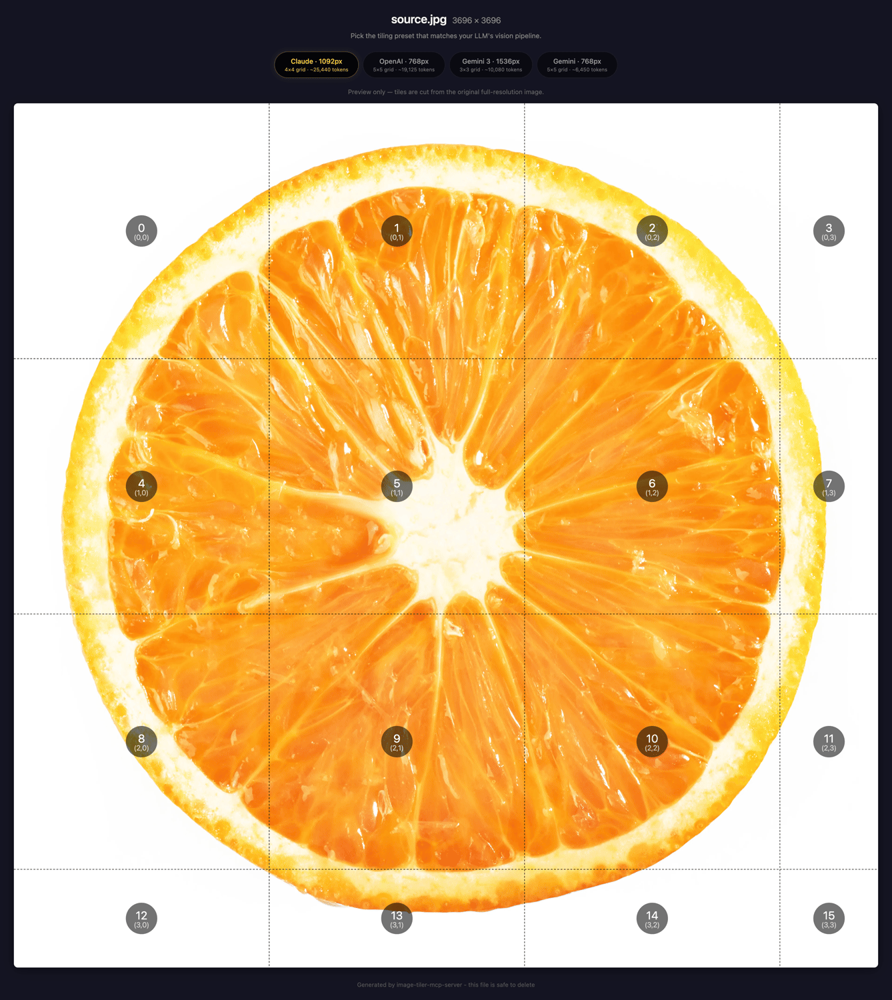

# image-tiler-mcp-server

[](https://www.npmjs.com/package/image-tiler-mcp-server)
[](https://github.com/keiver/image-tiler-mcp-server/blob/main/LICENSE)
[](https://nodejs.org/en)
[](https://lobehub.com/mcp/keiver-image-tiler-mcp-server)

MCP server that gives LLMs full-resolution vision by tiling images and capturing web pages before details are lost.

<figure align="center">
  
  <figcaption><i>The server generates an interactive HTML preview for every image, showing per-model tile grids and token estimates</i></figcaption>
</figure>

## What You Can Do

- **Visual QA for web pages.** Capture a URL, tile it, and let the LLM spot misaligned elements, wrong colors, and broken layouts at full resolution. Fix the code, re-capture, and verify the fix visually.

- **Mobile responsive testing.** Capture at any viewport width with mobile emulation, retina scaling, and a real mobile user agent. The LLM reviews the full mobile layout tile by tile, catching responsive breakpoint issues that only appear on small screens.

- **Full-resolution image analysis.** Diagrams, infographics, and design mockups lose critical details when LLMs downscale them. A 3,600 x 20,220px full-page capture that Claude would crush to ~279 x 1,568 becomes 76 analyzable tiles, each at native resolution.

- **Token-efficient tile inspection.** Each tile gets entropy-based content classification: blank, low-detail, mixed, or high-detail. The LLM skips blank tiles entirely and focuses tokens on what matters.

- **Iterative visual workflow.** Capture, analyze, fix, re-capture. Versioned output directories (`_v1`, `_v2`, ...) preserve each iteration so you can compare before and after without overwriting previous results.

## Quick Start

### Claude Code

```bash
claude mcp add image-tiler -- npx -y image-tiler-mcp-server
```

> `image-tiler` is a local alias. You can name it anything you like. `image-tiler-mcp-server` is the npm package that gets downloaded and run.

See [Claude Code MCP docs](https://code.claude.com/docs/en/mcp) for more info.

<details>
<summary>Codex CLI</summary>

```bash
codex mcp add image-tiler -- npx -y image-tiler-mcp-server
```

Or add to `~/.codex/config.toml`:

```toml
[mcp_servers.image-tiler]
command = "npx"
args = ["-y", "image-tiler-mcp-server"]
```

</details>

<details>
<summary>VS Code (Cline / Continue)</summary>

Add to your VS Code MCP settings:

```json
{
  "image-tiler": {
    "command": "npx",
    "args": ["-y", "image-tiler-mcp-server"]
  }
}
```

</details>

<details>
<summary>Cursor</summary>

Add to `~/.cursor/mcp.json`:

```json
{
  "mcpServers": {
    "image-tiler": {
      "command": "npx",
      "args": ["-y", "image-tiler-mcp-server"]
    }
  }
}
```

</details>

<details>
<summary>Claude Desktop</summary>

Add to your Claude Desktop config file:

- **macOS:** `~/Library/Application Support/Claude/claude_desktop_config.json`
- **Windows:** `%APPDATA%\Claude\claude_desktop_config.json`
- **Linux:** `~/.config/Claude/claude_desktop_config.json`

```json
{
  "mcpServers": {
    "image-tiler": {
      "command": "npx",
      "args": ["-y", "image-tiler-mcp-server"]
    }
  }
}
```

Restart Claude Desktop after editing.

</details>

<details>
<summary>Global Install (faster startup)</summary>

```bash
npm install -g image-tiler-mcp-server
```

Then use the simpler config in any client:

```json
{
  "command": "image-tiler-mcp-server"
}
```

</details>

<details>
<summary>From Source</summary>

```bash
git clone https://github.com/keiver/image-tiler-mcp-server.git
cd image-tiler-mcp-server
npm install
npm run build
```

Then point your MCP config to the built file:

```json
{
  "command": "node",
  "args": ["/absolute/path/to/image-tiler-mcp-server/dist/index.js"]
}
```

</details>

<details>
<summary>Docker</summary>

Build the image:

```bash
git clone https://github.com/keiver/image-tiler-mcp-server.git
cd image-tiler-mcp-server
docker build -t image-tiler-mcp-server .
```

The image includes Chromium for URL capture. Chrome runs without sandbox by default when the container runs as root. To run as the built-in `node` user (recommended), set `CHROME_NO_SANDBOX=1`:

```json
{
  "command": "docker",
  "args": [
    "run", "--rm", "-i",
    "-e", "CHROME_NO_SANDBOX=1",
    "-v", "/path/to/your/images:/data",
    "-e", "TILER_ALLOWED_DIRS=/data",
    "image-tiler-mcp-server"
  ]
}
```

The `-i` flag is required (stdio transport). Mount a volume for any directories the server needs to read from or write to, and set `TILER_ALLOWED_DIRS` to restrict file access to those mounts.

To disable URL capture entirely (no Chrome, no network access):

```json
{
  "command": "docker",
  "args": [
    "run", "--rm", "-i",
    "-e", "TILER_DISABLE_URL_CAPTURE=1",
    "-v", "/path/to/your/images:/data",
    "-e", "TILER_ALLOWED_DIRS=/data",
    "image-tiler-mcp-server"
  ]
}
```

</details>

## Usage

### Tile an image

> tile ~/source.png and analyze content 

The server reads image dimensions and generates an interactive HTML preview with per-model tabs showing grid overlays, tile counts, and token estimates. Pick the model that matches your use case, and the server tiles and returns batches for analysis.

### Capture a web page

> capture full page screenshot of https://tomotv.app 

The server launches headless Chrome, scrolls through the page to trigger lazy-loaded images (`loading="lazy"`), then captures a full-page screenshot (scroll-stitching pages over 16,384px). Your assistant receives each section at full resolution and can identify layout issues, misaligned elements, or broken styling that downscaling would hide.

To get only the screenshot without tiling, just ask for a screenshot and stop after the comparison step.

### Test a mobile layout

> capture https://tomotv.app in mobile view 

This is responsive QA, not just a different viewport. The server captures with `mobile: true`, which sets a 390px viewport, 2x retina scale, and a mobile Safari user agent. Sites that check for mobile UA or touch capability serve their mobile layout, so the LLM reviews exactly what a real phone user sees.

### Customize tiling

| What | Example prompt |
|------|---------------|
| Target a specific model | "Tile hero.png for OpenAI" |
| Keep full resolution | "Tile banner.png at full resolution, no downscaling" |
| PNG output | "Tile diagram.png as lossless PNG" |
| Tile from URL | "Download and tile https://keiver.dev/source.png" |
| Tile from base64 | "Tile this base64 image: iVBORw0KGgo..." |

## Presets

| Preset | Default tile | Tokens/tile | Max tile | ID |
|--------|-------------|-------------|----------|-----|
| Claude | 1092px | 1590 | 1568px | `claude` |
| OpenAI (GPT-4o/o-series) | 768px | 765 | 2048px | `openai` |
| Gemini | 768px | 258 | 768px | `gemini` |
| Gemini 3 | 1536px | 1120 | 3072px | `gemini3` |

> **OpenAI note:** The `openai` config targets the GPT-4o / o-series vision pipeline (512px tile patches). GPT-4.1 uses a fundamentally different pipeline (32x32 pixel patches) and is not currently supported. It would require a separate model config with a different calculation approach.

> **Gemini 3 note:** Gemini 3 uses a fixed token budget per image (1,120 tokens regardless of dimensions). Tiling increases total token cost but preserves fine detail. For cases where detail isn't critical, consider sending a single image instead.

## Why Tile?

You screenshot a full page, paste it into Claude, and Claude **crushes it to a thumbnail**. Any image with a long edge over 1,568 pixels gets auto-downscaled to fit within ~1.15 megapixels. A 3,600 x 20,220px full-page capture becomes ~279 x 1,568, losing over 99% of its pixels before the model even sees it.

GPT-4o is more forgiving but still destructive: it scales your image to fit within 2,048px, then scales the shortest side down to 768px, *then* tiles internally. An 8,192px-wide NASA panorama becomes ~1,456 x 768 before GPT-4o's own tiling even begins.

Gemini 1.5/2.0 handles large images natively at 768px tiles without downscaling. Gemini 3, however, caps each image at a fixed token budget (1,120 tokens) regardless of size. Tiling gives each piece its own budget.

Each tile stays within the model's sweet spot, so the LLM processes it at full resolution.

### What Happens Without Tiling

Using `assets/portrait.png` (3,600 x 20,220, a full-page National Geographic capture) as an example:

| Model | What happens | Impact |
|-------|-------------|--------|
| Claude | Auto-downscaled to ~279 x 1,568 | ~0.6% of original pixels survive |
| GPT-4o | Downscaled to ~365 x 2,048, then internally tiled | ~1% of original pixels survive the downscale |
| Gemini 3 | Capped at 1,120 tokens per image (default) | Fixed token budget regardless of image size |

> Gemini 1.5/2.0 tiles large images natively at 768px without downscaling.
> For Gemini 3, tiling multiplies the total token budget by sending each tile as a separate image.

### With Tiling

| Model | Tiles | Result |
|-------|-------|--------|
| Claude | 76 tiles at 1,092px | Every tile within 1,568px sweet spot, no downscaling |
| GPT-4o | 135 tiles at 768px | Every tile under 2,048px, no pre-downscale needed |
| Gemini 3 | 42 tiles at 1,536px | Each tile gets its own 1,120-token budget |

Using `assets/landscape.png` (8,192 x 4,320, NASA image gallery):

| Model | Without tiling | With tiling |
|-------|----------------|-------------|
| Claude | Auto-downscaled to ~1,568 x 827 (~3.7% of pixels survive) | 32 tiles at 1,092px, full analysis |
| GPT-4o | Downscaled to ~1,456 x 768 (~3% of pixels survive) | 66 tiles at 768px, full resolution |
| Gemini 3 | Capped at 1,120 tokens | 18 tiles at 1,536px, 18x token budget |

*Based on published model vision documentation as of Feb 2026:
[Claude vision limits](https://platform.claude.com/docs/en/build-with-claude/vision) ·
[OpenAI vision guide](https://developers.openai.com/api/docs/guides/images-vision) ·
[Gemini image understanding](https://ai.google.dev/gemini-api/docs/image-understanding) ·
[Gemini media resolution](https://ai.google.dev/gemini-api/docs/media-resolution)*

## How It Works

This MCP server:

1. Reads the image dimensions and the target model's vision config
2. Generates an interactive HTML preview with per-model tabs showing grid overlays, tile numbering, and token estimates
3. Calculates an optimal grid that keeps every tile within the model's sweet spot
4. Extracts tiles as individual images (WebP default, PNG optional) and saves them to disk
5. Returns a metadata summary (grid layout, file paths, token cost, per-tile content hints)
6. Serves tiles on demand: call with `tilesDir` + `start`/`end` to retrieve batches of up to 5 tiles

**Web capture pipeline.** For URLs, the server launches headless Chrome, triggers lazy-loaded images by scrolling the page, captures a full-page screenshot (scroll-stitching pages over 16,384px), then feeds the screenshot into the same tiling pipeline.

**Auto-downscaling.** Images over 10,000px on their longest side are automatically downscaled before tiling (configurable via `maxDimension`). This keeps tile counts reasonable and improves LLM comprehension by increasing content density per tile. Set `maxDimension=0` to disable, or pass a custom value (e.g., `maxDimension=5000`) for more aggressive downscaling.

<details>
<summary>Tool Reference</summary>

### `tiler`

One unified tool that handles all image tiling operations. The mode is auto-detected from the parameters you provide:

- **`tilesDir`** present → **Tile retrieval mode** (read-only pagination)
- **`url`** or **`screenshotPath`** present → **URL capture mode** (screenshot + tile)
- **`filePath`**, **`sourceUrl`**, **`dataUrl`**, or **`imageBase64`** present → **Tile-image mode**

> **Mode priority:** When multiple mode params are present, the tool resolves by priority:
> `tilesDir` > `url`/`screenshotPath` > `filePath`/`sourceUrl`/`dataUrl`/`imageBase64`.
> Avoid passing params from different modes in the same call.

**Workflow:**

The tool uses a two-step process to let you choose the right model before tiling:

1. **Compare** - Call with only the image source. Returns a comparison table showing tile counts and token estimates for each supported model, plus an interactive HTML preview.
2. **Tile** - Call again with the chosen `preset` + `outputDir` from step 1, plus:
   - **Image sources:** re-include your original source param (`filePath`, `sourceUrl`, etc.)
   - **Captures:** use `screenshotPath` from step 1 (not the original `url`)

> **Skip the comparison step:** Provide `preset` and `outputDir` on the first call to tile immediately.

> **Interactive model picker:** Clients that support MCP elicitation get a dropdown picker instead of the comparison table.

#### Parameters - Image Source (tile-image mode)

| Parameter | Type | Required | Default | Description |
|---|---|---|---|---|
| `filePath` | string | no* | - | Absolute or relative path to the image file |
| `sourceUrl` | string | no* | - | URL to download the image from (max 50MB, 30s timeout). `https:` uses SSRF filtering; `http:` is allowed without filtering for local dev servers |
| `dataUrl` | string | no* | - | Data URL with base64-encoded image |
| `imageBase64` | string | no* | - | Raw base64-encoded image data |

*At least one image source is required for tile-image mode.

#### Parameters - URL Capture (capture mode)

| Parameter | Type | Required | Default | Description |
|---|---|---|---|---|
| `url` | string | no | - | URL of the web page to capture. Requires Chrome/Chromium installed (or `CHROME_PATH` env var). |
| `screenshotPath` | string | no | - | Path to a previously captured screenshot. Skips URL capture when provided. |
| `viewportWidth` | number | no | `1280` (`390` when `mobile`) | Browser viewport width in pixels (320-3840) |
| `mobile` | boolean | no | `false` | Whether to emulate a mobile device. When true, defaults `viewportWidth` to 390, `deviceScaleFactor` to 2, and sets a mobile user agent. |
| `deviceScaleFactor` | number | no | `1` (`2` when `mobile`) | Device pixel ratio (0.1-5). Use `2` for retina, `3` for high-DPI mobile. |
| `userAgent` | string | no | - | Custom user agent string. Auto-set to a mobile Safari UA when `mobile: true` and no explicit value provided. |
| `waitUntil` | string | no | `"load"` | When to consider the page loaded: `"load"`, `"networkidle"`, or `"domcontentloaded"` |
| `delay` | number | no | `3000` | Additional delay in ms after page load (max 30000) |

Supports scroll-stitching for pages taller than 16,384px. Automatically triggers lazy-loaded images (`loading="lazy"`) before capture by scrolling through the page. Pages without lazy images are unaffected.

#### Parameters - Tile Retrieval (pagination mode)

| Parameter | Type | Required | Default | Description |
|---|---|---|---|---|
| `tilesDir` | string | no | - | Path to tiles directory (returned by a previous tiling call as `outputDir`) |
| `start` | number | no | `0` | Start tile index (0-based, inclusive) |
| `end` | number | no | start + 4 | End tile index (0-based, inclusive). Max 5 tiles per batch. |
| `skipBlankTiles` | boolean | no | `true` | Skip blank tiles and return a text annotation instead of an image. Set to `false` to include all tiles. |

#### Parameters - Tiling Config (shared across modes)

| Parameter | Type | Required | Default | Description |
|---|---|---|---|---|
| `preset` | string | no | Auto (cheapest) | Target vision preset: `"claude"`, `"openai"`, `"gemini"`, `"gemini3"`. Auto-selects the most token-efficient preset when omitted. |
| `tileSize` | number | no | Model default | Tile size in pixels. Clamped to model's supported range with a warning if out of bounds. |
| `maxDimension` | number | no | `10000` | Max dimension in px (0 to disable, or 256-65536). Values 1-255 are silently clamped to 256. Pre-downscales the image so its longest side fits within this value before tiling. |
| `outputDir` | string | no | See below | Directory to save tiles. Defaults: for `filePath` sources, `tiles/{name}_vN/` next to source (auto-incrementing: `_v1`, `_v2`, ..., `_vN`); for `sourceUrl`/`dataUrl`/`imageBase64`, `{base}/tiles/tiled_{timestamp}_{hex}/`; for captures, `{base}/tiles/capture_{timestamp}_{hex}/`. `{base}` is `~/Desktop`, `~/Downloads`, or `~` (first available). |
| `page` | number | no | `0` | Tile page to return (0 = first 5, 1 = next 5, etc.) |
| `format` | string | no | `"webp"` | Output format: `"webp"` (smaller, default) or `"png"` (lossless) |
| `includeMetadata` | boolean | no | `true` | Analyze each tile using image stats and return content classification (blank, low-detail, mixed, high-detail) plus `stdDev` and `entropy` values per tile |
| `model` | string | no | - | **Deprecated.** Use `preset` instead. Still accepted; emits a deprecation warning in the response. |

</details>

<details>
<summary>MCP Prompts and Resources</summary>

### Prompts

Guided workflows for clients that support [MCP prompts](https://modelcontextprotocol.io/docs/concepts/prompts):

| Prompt | Arguments | Description |
|--------|-----------|-------------|
| `tile-and-analyze` | `filePath` (required), `preset` (optional), `focus` (optional) | Walks through tiling a local image and analyzing each tile at full resolution. The `focus` argument narrows analysis (e.g., "UI layout", "text readability"). |
| `capture-and-analyze` | `url` (required), `focus` (optional) | Walks through capturing a web page screenshot and analyzing it tile by tile. |

### Resources

Static references for clients that support [MCP resources](https://modelcontextprotocol.io/docs/concepts/resources):

| URI | Format | Description |
|-----|--------|-------------|
| `tiler://models` | JSON | All supported vision model presets with tile sizes, min/max bounds, and per-tile token rates. |
| `tiler://guide` | Plain text | Quick reference covering the tiling workflow, preset summary, and usage tips. |

</details>

## Behaviors

- **Source conflict:** Multiple image source params → highest-precedence source is used with a warning (`filePath` > `sourceUrl` > `dataUrl` > `imageBase64`).
- **Re-entry:** If `outputDir` already has a preview from the comparison step, the server skips straight to tiling.
- **Elicitation cancellation:** Cancelling the model picker returns `"Tiling cancelled by user."` without tiling.
- **Versioned output:** Repeated tiling of the same source creates `_v1`, `_v2`, ..., `_vN` directories to avoid overwriting.
- **Tile naming:** `tile_ROW_COL.{format}` with zero-padded 3-digit indices (e.g., `tile_000_003.webp`), row-by-row, left-to-right.

## Supported Formats

PNG, JPEG, WebP, TIFF, GIF

## Troubleshooting

**"Command not found"** - Make sure Node.js 20+ is installed: `node --version`

**"File not found"** - Use absolute paths. Relative paths resolve from the MCP server's working directory.

**"MCP tools not available"** - Restart your MCP client after config changes. In Claude Code, run `/mcp` to check server status.

**"Chrome not found"** - Install Google Chrome or set the `CHROME_PATH` environment variable to the Chrome executable (must be an absolute path).

**Running as root / in Docker** - Set `CHROME_NO_SANDBOX=1` to launch Chrome without sandbox (also enabled automatically when running as root).

## Security

**Transport:** stdio only. The server is a single-session local process spawned by the MCP client. It never listens on a network socket.

### URL download protection (always-on)

`https:` `sourceUrl` downloads use [`request-filtering-agent`](https://github.com/azu/request-filtering-agent), which blocks requests to private IP ranges before they are made:

- RFC 1918 (10.x, 172.16-31.x, 192.168.x)
- Loopback (127.x, ::1)
- Link-local / IMDS (169.254.x, fe80::/10) including IPv4-mapped IPv6 (`::ffff:169.254.169.254`)
- CGNAT (100.64.x), ULA (fc00::/7)

HTTP redirects are followed up to 5 hops. Each hop re-applies SSRF filtering for `https:` URLs, so a redirect to a private IP is blocked even if the initial URL was public. `https:` to `http:` downgrades are blocked. `http:` downloads bypass SSRF filtering, intended for local dev servers (localhost, LAN IPs). Use `https:` for all remote/production URLs.

**Limitation:** DNS rebinding is mitigated but not fully prevented at the application layer.

### Path containment (opt-in via `TILER_ALLOWED_DIRS`)

Set `TILER_ALLOWED_DIRS` to a comma-separated list of absolute paths to restrict all file I/O to those directories:

```
TILER_ALLOWED_DIRS=/app/uploads,/tmp/tiler-work
```

When set:
- `filePath` and `tilesDir` inputs are checked via `fs.realpath()` (resolves symlinks) before access.
- `outputDir` writes are checked against the nearest existing ancestor to prevent path traversal through non-existing directories.
- Any path outside the allowed list is rejected with an `[TILER_ALLOWED_DIRS]` error.

When unset, no path restriction is applied (preserves backward-compatible local behaviour).

### Chrome URL capture kill switch

Chrome headless can reach any network address the host can reach. Application-level IP checks cannot reliably constrain it. For cloud deployments without a `NetworkPolicy` or equivalent, disable URL capture entirely:

```
TILER_DISABLE_URL_CAPTURE=1
```

Any call with a `url` parameter will return an error instead of spawning Chrome.

**Docker example:**

```env
CHROME_NO_SANDBOX=1
TILER_ALLOWED_DIRS=/app/uploads
TILER_DISABLE_URL_CAPTURE=1   # remove only if Chrome is network-isolated
```

## Requirements

- Node.js 20+
- Compatible MCP client (Claude Code, Codex CLI, VS Code, Cursor, Claude Desktop)

## Contributing

See [CONTRIBUTING.md](CONTRIBUTING.md) for how to report bugs, suggest changes, and submit PRs.

## Acknowledgments

Built with the help of [Claude Code](https://code.claude.com/docs/en/setup) as an AI assistant for code drafting, testing, and documentation.

## License

MIT

## Links

- [GitHub Repository](https://github.com/keiver/image-tiler-mcp-server)
- [NPM Package](https://www.npmjs.com/package/image-tiler-mcp-server)
- [Report Issues](https://github.com/keiver/image-tiler-mcp-server/issues)
